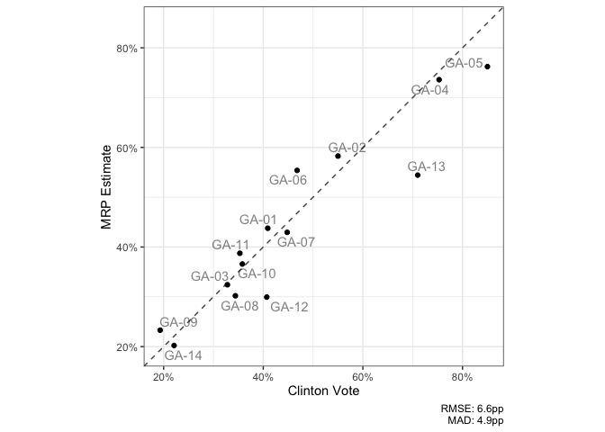
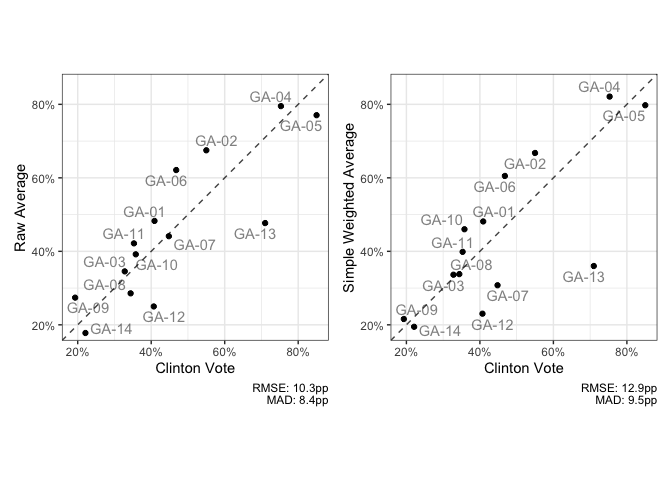

Running MRP with CCES
================

<!-- badges: start -->

[](https://github.com/kuriwaki/ccesMRPrun/actions)

<!-- badges: end -->

This is a set of functions to facilitate running MRP models on CCES data
and is a companion to
[`ccesMRPprep`](www.shirokuriwaki.com/ccesMRPprep).

To install,

``` r
remotes::install_github("kuriwaki/ccesMRPrun")
```

The **main functions** in this package are:

1.  `fit_brms` for fitting a multilevel model (or `fit_brms_binomial`)
2.  `poststrat_draws` for extracting posterior draws for each area
3.  `summ_sims` for obtaining summary statistics from these draws
4.  `scatter_45` for clearly visualizing the relationship between the
    truth and estimate

See below for a demonstration with an example in the state of Georgia.

``` r
library(ccesMRPrun)
library(tidyverse)
```

# Fitting

This is a simple wrapper around `brms::brm` but with some custom priors
and a binomial model as a default.

``` r
form <- "response ~ (1|age) + (1 + female |educ) + clinton_vote + (1|cd)"

cc_voters <- filter(cces_GA, vv_turnout_gvm == "Voted")

# turn into counts
fit <- fit_brms(form, cc_voters, verbose = FALSE)
```

    ## Running /Library/Frameworks/R.framework/Resources/bin/R CMD SHLIB foo.c
    ## clang -mmacosx-version-min=10.13 -I"/Library/Frameworks/R.framework/Resources/include" -DNDEBUG   -I"/Library/Frameworks/R.framework/Versions/4.0/Resources/library/Rcpp/include/"  -I"/Library/Frameworks/R.framework/Versions/4.0/Resources/library/RcppEigen/include/"  -I"/Library/Frameworks/R.framework/Versions/4.0/Resources/library/RcppEigen/include/unsupported"  -I"/Library/Frameworks/R.framework/Versions/4.0/Resources/library/BH/include" -I"/Library/Frameworks/R.framework/Versions/4.0/Resources/library/StanHeaders/include/src/"  -I"/Library/Frameworks/R.framework/Versions/4.0/Resources/library/StanHeaders/include/"  -I"/Library/Frameworks/R.framework/Versions/4.0/Resources/library/RcppParallel/include/"  -I"/Library/Frameworks/R.framework/Versions/4.0/Resources/library/rstan/include" -DEIGEN_NO_DEBUG  -DBOOST_DISABLE_ASSERTS  -DBOOST_PENDING_INTEGER_LOG2_HPP  -DSTAN_THREADS  -DBOOST_NO_AUTO_PTR  -include '/Library/Frameworks/R.framework/Versions/4.0/Resources/library/StanHeaders/include/stan/math/prim/mat/fun/Eigen.hpp'  -D_REENTRANT -DRCPP_PARALLEL_USE_TBB=1   -I/usr/local/include   -fPIC  -Wall -g -O2  -c foo.c -o foo.o
    ## In file included from <built-in>:1:
    ## In file included from /Library/Frameworks/R.framework/Versions/4.0/Resources/library/StanHeaders/include/stan/math/prim/mat/fun/Eigen.hpp:13:
    ## In file included from /Library/Frameworks/R.framework/Versions/4.0/Resources/library/RcppEigen/include/Eigen/Dense:1:
    ## In file included from /Library/Frameworks/R.framework/Versions/4.0/Resources/library/RcppEigen/include/Eigen/Core:88:
    ## /Library/Frameworks/R.framework/Versions/4.0/Resources/library/RcppEigen/include/Eigen/src/Core/util/Macros.h:613:1: error: unknown type name 'namespace'
    ## namespace Eigen {
    ## ^
    ## /Library/Frameworks/R.framework/Versions/4.0/Resources/library/RcppEigen/include/Eigen/src/Core/util/Macros.h:613:16: error: expected ';' after top level declarator
    ## namespace Eigen {
    ##                ^
    ##                ;
    ## In file included from <built-in>:1:
    ## In file included from /Library/Frameworks/R.framework/Versions/4.0/Resources/library/StanHeaders/include/stan/math/prim/mat/fun/Eigen.hpp:13:
    ## In file included from /Library/Frameworks/R.framework/Versions/4.0/Resources/library/RcppEigen/include/Eigen/Dense:1:
    ## /Library/Frameworks/R.framework/Versions/4.0/Resources/library/RcppEigen/include/Eigen/Core:96:10: fatal error: 'complex' file not found
    ## #include <complex>
    ##          ^~~~~~~~~
    ## 3 errors generated.
    ## make: *** [foo.o] Error 1

``` r
summary(fit)
```

    ##  Family: binomial 
    ##   Links: mu = logit 
    ## Formula: yes | trials(n_response) ~ (1 | age) + (1 + female | educ) + clinton_vote + (1 | cd) 
    ##    Data: .data (Number of observations: 347) 
    ## Samples: 4 chains, each with iter = 2000; warmup = 1000; thin = 1;
    ##          total post-warmup samples = 4000
    ## 
    ## Group-Level Effects: 
    ## ~age (Number of levels: 5) 
    ##               Estimate Est.Error l-95% CI u-95% CI Rhat Bulk_ESS Tail_ESS
    ## sd(Intercept)     0.13      0.13     0.00     0.49 1.00     1949     1950
    ## 
    ## ~cd (Number of levels: 14) 
    ##               Estimate Est.Error l-95% CI u-95% CI Rhat Bulk_ESS Tail_ESS
    ## sd(Intercept)     0.37      0.15     0.10     0.71 1.00      980      825
    ## 
    ## ~educ (Number of levels: 4) 
    ##                       Estimate Est.Error l-95% CI u-95% CI Rhat Bulk_ESS
    ## sd(Intercept)             0.37      0.29     0.02     1.10 1.00     1241
    ## sd(female)                0.72      0.33     0.23     1.55 1.00     2102
    ## cor(Intercept,female)     0.11      0.55    -0.86     0.95 1.00     1061
    ##                       Tail_ESS
    ## sd(Intercept)             1311
    ## sd(female)                1814
    ## cor(Intercept,female)     1835
    ## 
    ## Population-Level Effects: 
    ##              Estimate Est.Error l-95% CI u-95% CI Rhat Bulk_ESS Tail_ESS
    ## Intercept       -2.04      0.43    -2.96    -1.22 1.00     2056     2324
    ## clinton_vote     3.74      0.71     2.41     5.20 1.00     2193     2239
    ## 
    ## Samples were drawn using sampling(NUTS). For each parameter, Bulk_ESS
    ## and Tail_ESS are effective sample size measures, and Rhat is the potential
    ## scale reduction factor on split chains (at convergence, Rhat = 1).

# Poststratification

We can take predicted values from each of the MCMC draws, and aggregate
it up to the area of interest.

``` r
drw <- poststrat_draws(fit, 
                       poststrat_tgt = acs_GA)
drw
```

    ## # A tibble: 56,000 x 3
    ##    cd     iter p_mrp
    ##    <chr> <dbl> <dbl>
    ##  1 GA-01     1 0.429
    ##  2 GA-01     2 0.390
    ##  3 GA-01     3 0.517
    ##  4 GA-01     4 0.392
    ##  5 GA-01     5 0.574
    ##  6 GA-01     6 0.504
    ##  7 GA-01     7 0.536
    ##  8 GA-01     8 0.340
    ##  9 GA-01     9 0.425
    ## 10 GA-01    10 0.412
    ## # … with 55,990 more rows

# Summaries

We often care about the posterior mean and 95 percent credible intervals
of the draws.

``` r
summ_sims(drw)
```

    ## # A tibble: 14 x 9
    ##    cd    p_mrp_est p_mrp_025 p_mrp_050 p_mrp_100 p_mrp_500 p_mrp_900 p_mrp_950
    ##    <chr>     <dbl>     <dbl>     <dbl>     <dbl>     <dbl>     <dbl>     <dbl>
    ##  1 GA-01     0.438     0.339     0.354     0.370     0.434     0.509     0.530
    ##  2 GA-02     0.583     0.463     0.479     0.499     0.581     0.670     0.691
    ##  3 GA-03     0.324     0.234     0.250     0.267     0.322     0.384     0.404
    ##  4 GA-04     0.736     0.643     0.657     0.675     0.737     0.795     0.812
    ##  5 GA-05     0.762     0.664     0.683     0.702     0.764     0.820     0.834
    ##  6 GA-06     0.554     0.455     0.470     0.487     0.552     0.623     0.643
    ##  7 GA-07     0.429     0.337     0.351     0.369     0.430     0.490     0.507
    ##  8 GA-08     0.302     0.200     0.219     0.237     0.302     0.367     0.385
    ##  9 GA-09     0.233     0.161     0.172     0.185     0.231     0.284     0.300
    ## 10 GA-10     0.366     0.278     0.292     0.308     0.364     0.427     0.445
    ## 11 GA-11     0.387     0.302     0.315     0.332     0.386     0.445     0.464
    ## 12 GA-12     0.299     0.193     0.207     0.225     0.300     0.371     0.391
    ## 13 GA-13     0.544     0.418     0.441     0.465     0.546     0.622     0.644
    ## 14 GA-14     0.202     0.119     0.130     0.146     0.202     0.259     0.277
    ## # … with 1 more variable: p_mrp_975 <dbl>

Append the truth and a baseline raw-sample

``` r
dir_val <- group_by(cc_voters, cd) %>% 
  summarize(p_raw = mean(response, na.rm = TRUE),
            p_ygw = weighted.mean(response, weight_post, na.rm = TRUE), 
            .groups = "drop")

mrp_val <- summ_sims(drw) %>% 
  left_join(distinct(acs_GA, cd, clinton_vote), by = "cd") %>% 
  left_join(dir_val, by = "cd")
```

# Visualization

A wrapper for visualizing the accuracy relationship

``` r
scatter_45(mrp_val, clinton_vote, p_mrp_est, cd,
           xlab = "Clinton Vote",
           ylab = "MRP Estimate")
```



Compare this with raw estimates:

<!-- -->

It may be easier to store the models in long form and show them at once.

``` r
# reshape to long
mrp_long <- mrp_val %>% 
    select(cd, p_mrp_est, p_raw, p_ygw, clinton_vote) %>% 
    pivot_longer(-c(cd, clinton_vote), names_to = "model") 

# plot
scatter_45(mrp_long, 
           clinton_vote, 
           value, 
           by_form = ~model,
           by_labels = c(p_mrp_est = "MRP", p_raw = "Raw", p_ygw = "YouGov Weighted"),
           xlab = "Clinton Vote",
           ylab = "Estimate")
```

<!-- -->
