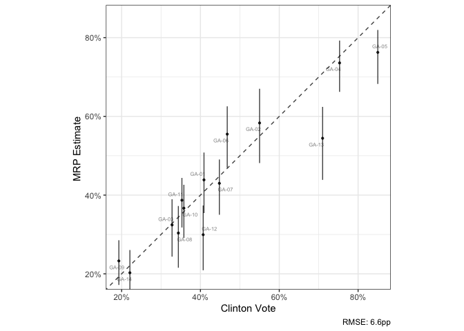
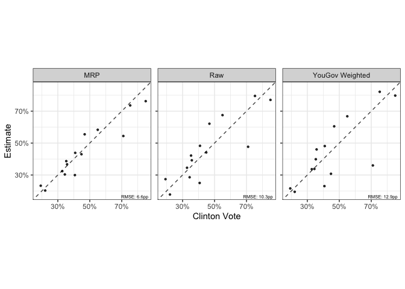

Running MRP with CCES
================

<!-- badges: start -->

[](https://github.com/kuriwaki/ccesMRPrun/actions)
[](https://www.tidyverse.org/lifecycle/#experimental)
<!-- badges: end -->

<!-- badges: end -->

Cite as:

- Shiro Kuriwaki (2022). ccesMRPrun: Fitting and Visualizing MRP Models
  from Cleaned CCES and Census Data. R package.
  <https://www.github.com/kuriwaki/ccesMRPrun>

This is a set of functions to facilitate running MRP models on CCES data
and is a companion to
[**`ccesMRPprep`**](https://www.shirokuriwaki.com/ccesMRPprep).

To install,

``` r
remotes::install_github("kuriwaki/ccesMRPrun")
```

The **main functions** in this package are:

1.  `fit_brms()` for fitting a multilevel model (or `fit_brms_binomial`)
2.  `poststrat_draws()` for extracting posterior draws for each area
3.  `summ_sims()` for obtaining summary statistics from these draws
4.  `scatter_45()` (in ccesMRPviz) for clearly visualizing the
    relationship between the truth and estimate

Steps 1-3 can be done via `mrp_onestep()`.

See below for a demonstration with an example in the state of Georgia.

``` r
library(ccesMRPrun)
library(tidyverse)
library(ccesMRPviz)
```

# Fitting

This is a simple wrapper around `brms::brm` but with some custom priors
and a binomial model as a default.

The two key parts of the workflow is a formula and a data. The formula
should be a brms formula with a binary variable in the outcome. The data
should be individual level data and have all the variables mentioned in
the formula.

``` r
form <- response ~ (1|age) + (1 + female |educ) + clinton_vote + (1|cd)
cc_voters <- filter(cces_GA, vv_turnout_gvm == "Voted")
```

Now fit the model. `fit_brms` is basically the `brm` function, but with
some wrappers.

``` r
fit <- fit_brms(form, cc_voters, verbose = FALSE, .backend = "cmdstanr")
```

    ## Running MCMC with 4 parallel chains...
    ## 
    ## Chain 3 finished in 4.2 seconds.
    ## Chain 4 finished in 4.5 seconds.
    ## Chain 1 finished in 4.7 seconds.
    ## Chain 2 finished in 4.8 seconds.
    ## 
    ## All 4 chains finished successfully.
    ## Mean chain execution time: 4.5 seconds.
    ## Total execution time: 4.9 seconds.

``` r
class(fit)
```

    ## [1] "brmsfit"

The `cmdstanr` is more lightweight than `rstan` and takes advantage of
all the latest improvements. However, you will need to install the
package from Github (rather than CRAN) and run the following command
once:

``` r
cmdstanr::check_cmdstan_toolchain()
cmdstanr::install_cmdstan(cores = 2)
```

To avoid this, you can just not specify `.backend` and it will default
to `rstan`.

# Poststratification

We can take predicted values from each of the MCMC draws, and aggregate
it up to the area of interest.

Here we use the poststratification data to fit *on*. We use the `acs_GA`
built-in data here, but refer to
[`ccesMRPprep`](www.shirokuriwaki.com/ccesMRPprep) to make a data that
is your own.

``` r
drw <- poststrat_draws(fit, poststrat_tgt = acs_GA)
drw
```

    ## # A tibble: 56,000 × 3
    ##    cd     iter p_mrp
    ##    <chr> <dbl> <dbl>
    ##  1 GA-01     1 0.544
    ##  2 GA-01     2 0.331
    ##  3 GA-01     3 0.421
    ##  4 GA-01     4 0.396
    ##  5 GA-01     5 0.469
    ##  6 GA-01     6 0.473
    ##  7 GA-01     7 0.452
    ##  8 GA-01     8 0.458
    ##  9 GA-01     9 0.462
    ## 10 GA-01    10 0.392
    ## # ℹ 55,990 more rows

# Summaries

We often care about the posterior mean and 95 percent credible intervals
of the draws.

``` r
mrp_val <- summ_sims(drw)
```

Append the truth and a baseline raw-sample

``` r
dir_val <- direct_ests(form, cc_voters, 
                       area_var = "cd", 
                       weight_var = "weight_post")

mrp_val <- summ_sims(drw) %>% 
  left_join(elec_GA, by = "cd") %>% 
  left_join(dir_val, by = "cd")
```

# Visualization

A wrapper for visualizing the accuracy relationship, from
[**`ccesMRPviz`**](https://github.com/kuriwaki/ccesMRPviz).

``` r
scatter_45(mrp_val, clinton_vote, p_mrp_est, 
           lblvar = cd,
           ubvar = p_mrp_900,
           lbvar = p_mrp_050,
           xlab = "Clinton Vote",
           ylab = "MRP Estimate ")
```



Compare this with raw estimates:

<!-- -->

It may be easier to store the models in long form and show them at once.

``` r
# reshape to long
mrp_long <- mrp_val %>% 
    select(cd, p_mrp_est, p_raw, p_wt, clinton_vote) %>% 
    pivot_longer(-c(cd, clinton_vote), names_to = "model") 

# plot
scatter_45(mrp_long, 
           clinton_vote, 
           value, 
           by_form = ~model,
           by_labels = c(p_mrp_est = "MRP", p_raw = "Raw", p_wt = "YouGov Weighted"),
           xlab = "Clinton Vote",
           ylab = "Estimate")
```

<!-- -->
